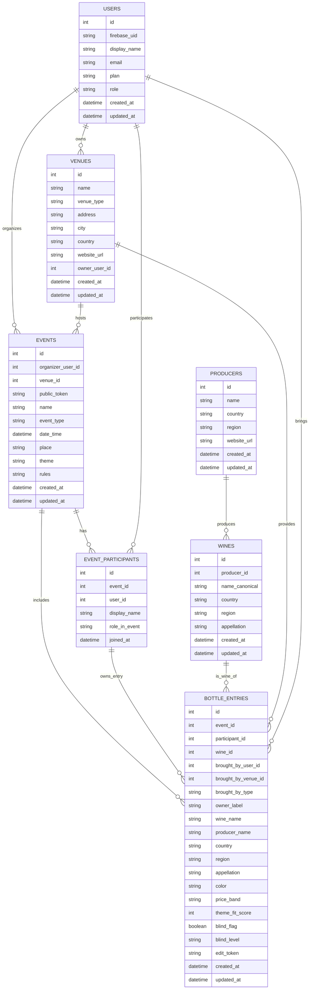

# VinMemo ER 図 v1.2

```mermaid
erDiagram

  USERS {
    int id
    string firebase_uid
    string display_name
    string email
    string plan
    string role
    datetime created_at
    datetime updated_at
  }

  VENUES {
    int id
    string name
    string venue_type
    string address
    string city
    string country
    string website_url
    int owner_user_id
    datetime created_at
    datetime updated_at
  }

  EVENTS {
    int id
    int organizer_user_id
    int venue_id
    string public_token
    string name
    string event_type
    datetime date_time
    string place
    string theme
    string rules
    datetime created_at
    datetime updated_at
  }

  EVENT_PARTICIPANTS {
    int id
    int event_id
    int user_id
    string display_name
    string role_in_event
    datetime joined_at
  }

  PRODUCERS {
    int id
    string name
    string country
    string region
    string website_url
    datetime created_at
    datetime updated_at
  }

  WINES {
    int id
    int producer_id
    string name_canonical
    string country
    string region
    string appellation
    datetime created_at
    datetime updated_at
  }

  BOTTLE_ENTRIES {
    int id
    int event_id
    int participant_id
    int wine_id
    int brought_by_user_id
    int brought_by_venue_id
    string brought_by_type
    string owner_label
    string wine_name
    string producer_name
    string country
    string region
    string appellation
    string color
    string price_band
    int theme_fit_score
    boolean blind_flag
    string blind_level
    string edit_token
    datetime created_at
    datetime updated_at
  }

  USERS ||--o{ EVENTS : organizes
  VENUES ||--o{ EVENTS : hosts
  EVENTS ||--o{ EVENT_PARTICIPANTS : has
  USERS ||--o{ EVENT_PARTICIPANTS : participates
  EVENTS ||--o{ BOTTLE_ENTRIES : includes
  EVENT_PARTICIPANTS ||--o{ BOTTLE_ENTRIES : owns_entry
  WINES ||--o{ BOTTLE_ENTRIES : is_wine_of
  PRODUCERS ||--o{ WINES : produces
  VENUES ||--o{ BOTTLE_ENTRIES : provides
  USERS ||--o{ VENUES : owns
  USERS ||--o{ BOTTLE_ENTRIES : brings
```

(Note: The existing database uses `title` for `name` and `event_date` for `date_time` in the `events` table. This ERD reflects the target v1.2 design.)
