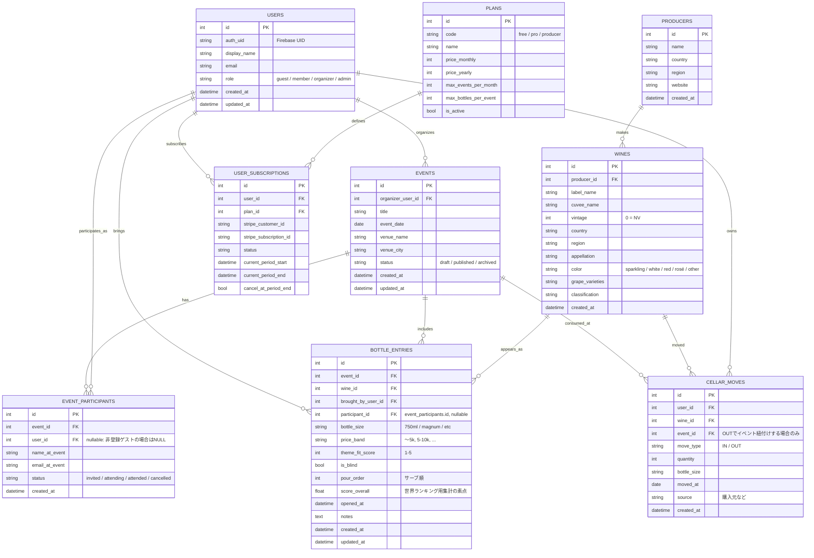

# VinMemo ER 図 v1

```mermaid
erDiagram

  USERS {
    int id PK
    string auth_uid  "Firebase UID"
    string display_name
    string email
    string role  "guest / member / organizer / admin"
    datetime created_at
    datetime updated_at
  }

  EVENTS {
    int id PK
    int organizer_user_id FK
    string title
    date event_date
    string venue_name
    string venue_city
    string status  "draft / published / archived"
    datetime created_at
    datetime updated_at
  }

  EVENT_PARTICIPANTS {
    int id PK
    int event_id FK
    int user_id FK "nullable: 非登録ゲストの場合はNULL"
    string name_at_event
    string email_at_event
    string status  "invited / attending / attended / cancelled"
    datetime created_at
  }

  PRODUCERS {
    int id PK
    string name
    string country
    string region
    string website
    datetime created_at
  }

  WINES {
    int id PK
    int producer_id FK
    string label_name
    string cuvee_name
    int vintage  "0 = NV"
    string country
    string region
    string appellation
    string color  "sparkling / white / red / rosé / other"
    string grape_varieties
    string classification
    datetime created_at
  }

  BOTTLE_ENTRIES {
    int id PK
    int event_id FK
    int wine_id FK
    int brought_by_user_id FK
    int participant_id FK "event_participants.id, nullable"
    string bottle_size  "750ml / magnum / etc"
    string price_band   "〜5k, 5-10k, ..."
    int theme_fit_score "1-5"
    bool is_blind
    int pour_order      "サーブ順"
    float score_overall "世界ランキング用集計の素点"
    datetime opened_at
    text notes
    datetime created_at
    datetime updated_at
  }

  CELLAR_MOVES {
    int id PK
    int user_id FK
    int wine_id FK
    int event_id FK "OUTでイベント紐付けする場合のみ"
    string move_type  "IN / OUT"
    int quantity
    string bottle_size
    date moved_at
    string source  "購入元など"
    datetime created_at
  }

  PLANS {
    int id PK
    string code  "free / pro / producer"
    string name
    int price_monthly
    int price_yearly
    int max_events_per_month
    int max_bottles_per_event
    bool is_active
  }

  USER_SUBSCRIPTIONS {
    int id PK
    int user_id FK
    int plan_id FK
    string stripe_customer_id
    string stripe_subscription_id
    string status
    datetime current_period_start
    datetime current_period_end
    bool cancel_at_period_end
  }

  %% リレーション

  USERS ||--o{ EVENTS : organizes
  USERS ||--o{ EVENT_PARTICIPANTS : participates_as
  EVENTS ||--o{ EVENT_PARTICIPANTS : has

  PRODUCERS ||--o{ WINES : makes
  WINES ||--o{ BOTTLE_ENTRIES : appears_as
  EVENTS ||--o{ BOTTLE_ENTRIES : includes
  USERS ||--o{ BOTTLE_ENTRIES : brings

  USERS ||--o{ CELLAR_MOVES : owns
  WINES ||--o{ CELLAR_MOVES : moved
  EVENTS ||--o{ CELLAR_MOVES : consumed_at

  PLANS ||--o{ USER_SUBSCRIPTIONS : defines
  USERS ||--o{ USER_SUBSCRIPTIONS : subscribes
```